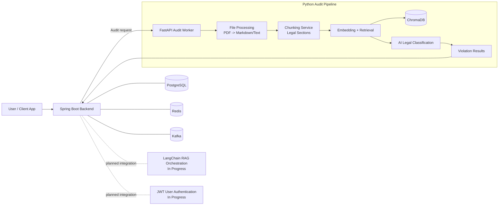

# Contract Audit Pipeline

Contract Audit Pipeline is a multi-service system for legal contract risk analysis. It combines a Spring Boot backend with a Python AI worker to detect potentially risky or non-compliant clauses by comparing contract text against policy knowledge.

## Overview

The project is designed to:

- Ingest contract files (PDF or text)
- Convert and normalize document content
- Split contracts into legally meaningful chunks
- Retrieve related policy context from a vector database
- Classify and score potential violations with AI
- Return structured legal-audit output for downstream use

The current implementation already includes the working Python audit flow and the Spring backend foundation, with orchestration and authentication layers being expanded.

## Architecture Flowchart

## Architecture Notes

- Spring Boot is the main backend foundation and integration layer.
- FastAPI handles AI-heavy document analysis.
- ChromaDB stores and serves policy vectors for retrieval.
- PostgreSQL and Redis are configured for application data and caching/session support.
- Kafka is present for event-driven pipeline expansion.
- LangChain-based RAG orchestration and JWT auth are being integrated.

## Tech Stack

| Layer | Technology |
|---|---|
| Backend API | Spring Boot, Java |
| AI Worker API | FastAPI, Uvicorn, Python |
| Document Parsing | PyMuPDF, pymupdf4llm |
| Text Chunking | LangChain text splitters |
| Embeddings | sentence-transformers |
| Vector Store | ChromaDB |
| LLM Integration | Groq SDK, Google Generative AI SDK |
| Messaging | Apache Kafka |
| Database | PostgreSQL |
| Cache / Fast Access | Redis |
| Validation / Config | Pydantic, pydantic-settings |
| Containerized Services | Docker Compose |

## Codebase Layout

- `spring-backend/`
	Spring Boot application scaffold including domain models, DTOs, repositories, and application configuration.

- `python-pipeline/`
	FastAPI-based AI audit worker and supporting modules.

- `python-pipeline/app/api/`
	API routes for audit endpoints.

- `python-pipeline/app/services/`
	Core services for upload processing, chunking, embedding, retrieval, and AI-based auditing.

- `python-pipeline/app/models/`
	Data schemas for audit output models.

- `python-pipeline/app/violation-policies/` and `python-pipeline/app/output_md/`
	Policy source and generated markdown artifacts used by the pipeline.

- `docker-compose.yaml`
	Infrastructure service definitions for Kafka, ChromaDB, PostgreSQL, and Redis.

